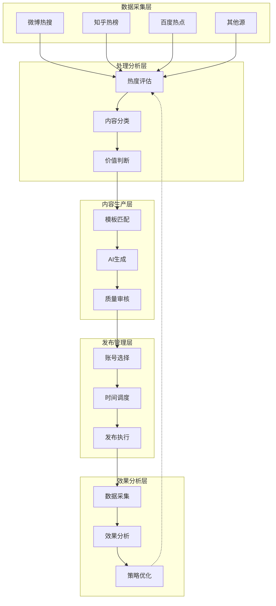
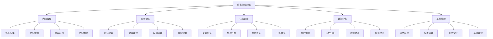
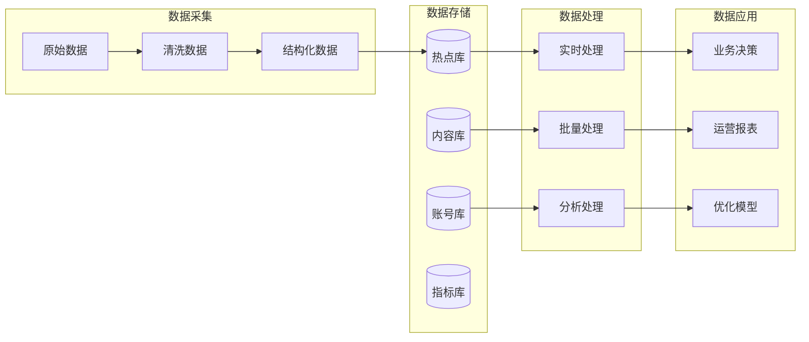
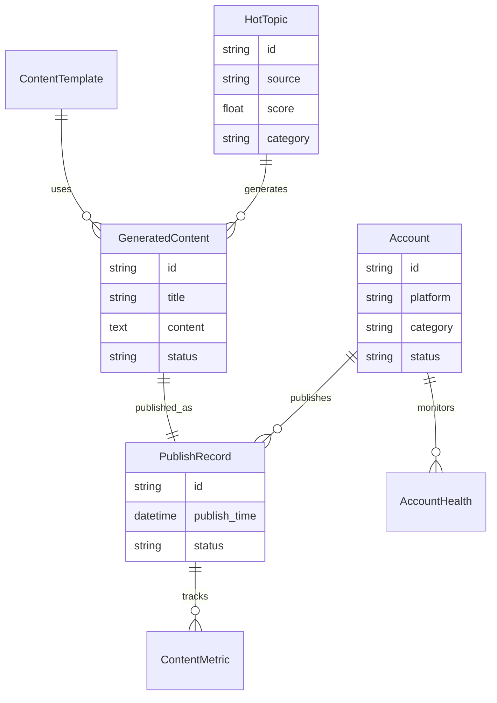
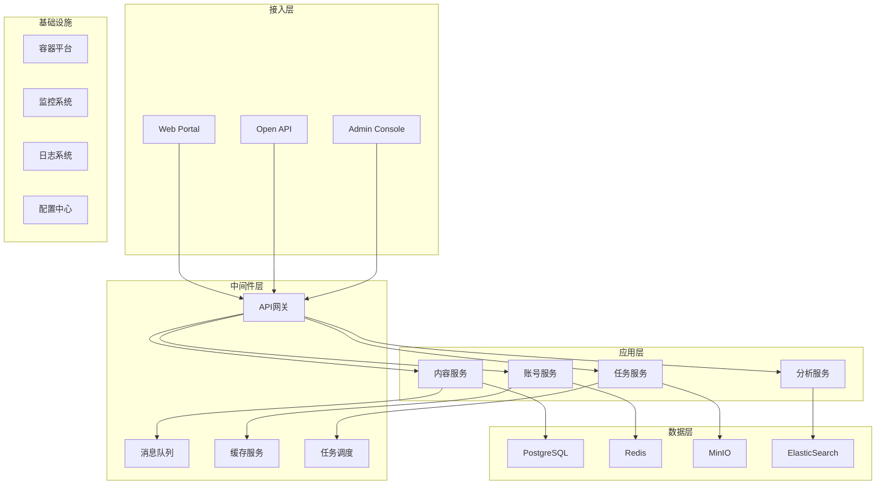
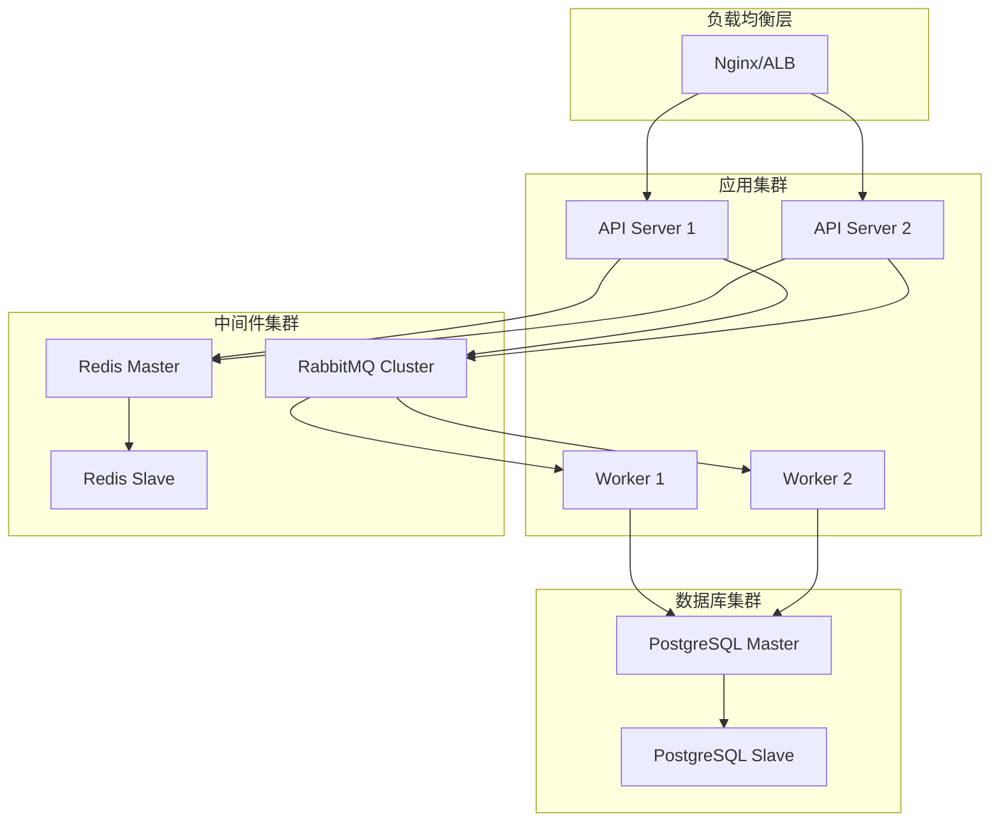
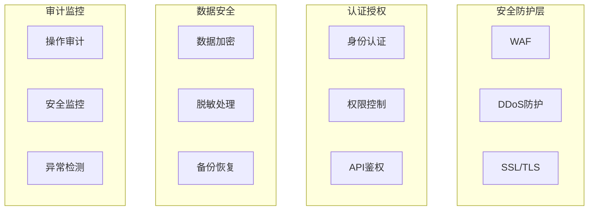
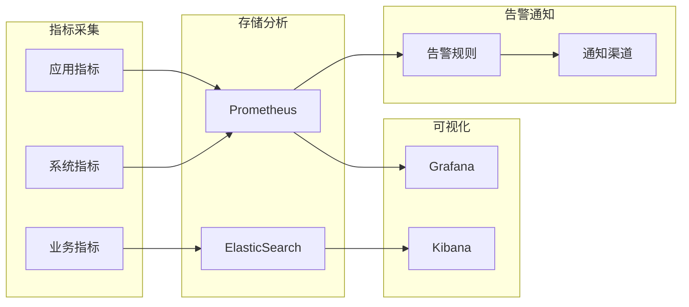

# 头条矩阵系统设计文档

## 1. 系统概述

### 1.1 系统定位
本系统是一个智能内容生产与发布平台，通过自动化技术实现热点内容的采集、分析、生成和多账号矩阵发布，最终达到内容变现的目标。

### 1.2 核心价值
- **效率提升**：将内容生产效率提升10倍以上
- **质量保证**：通过AI和算法保证内容质量
- **风险控制**：智能管理账号健康度，降低封号风险
- **数据驱动**：基于数据分析持续优化内容策略

### 1.3 系统边界
- **包含**：内容采集、生成、发布、分析的完整流程
- **不包含**：内容的人工创作、视频制作、直播功能

## 2. 业务架构设计

### 2.1 业务流程图



### 2.2 业务能力地图

| 业务域 | 核心能力 | 子能力 | 说明 |
|--------|----------|--------|------|
| 内容采集 | 多源采集 | 热点识别<br>数据抓取<br>格式统一 | 支持10+主流平台 |
| 内容分析 | 智能分析 | 分类识别<br>热度计算<br>价值评估 | 准确率>90% |
| 内容生成 | AI创作 | 模板管理<br>智能生成<br>风格适配 | 支持多种文体 |
| 账号管理 | 矩阵管理 | 健康监控<br>风险预警<br>智能调度 | 支持100+账号 |
| 发布调度 | 智能发布 | 时间优化<br>频率控制<br>失败重试 | 成功率>95% |
| 数据分析 | 效果追踪 | 实时监控<br>趋势分析<br>收益计算 | 分钟级更新 |

## 3. 功能架构设计

### 3.1 功能模块划分



### 3.2 核心功能设计

#### 3.2.1 热点采集功能

**功能目标**：实时采集各平台热点，识别有价值的内容素材

**设计要点**：
- 支持配置化的采集规则
- 具备反爬虫能力（代理池、请求频率控制）
- 自动去重机制（基于内容指纹）
- 热度评分算法（综合多维度指标）

**数据流向**：
```
采集源 → 数据清洗 → 去重检查 → 热度计算 → 分类存储
```

#### 3.2.2 内容生成功能

**功能目标**：基于热点素材，生成高质量的原创内容

**设计要点**：
- 多模板支持（新闻、评论、科普等）
- AI模型选择策略（根据内容类型）
- 内容优化pipeline（标题、配图、排版）
- 质量评分机制

**生成策略**：
| 内容类型 | AI模型 | 温度参数 | 长度控制 | 风格特点 |
|----------|---------|----------|----------|----------|
| 科技资讯 | GPT-4 | 0.7 | 1500字 | 专业、严谨 |
| 生活分享 | Claude | 0.8 | 1000字 | 轻松、亲切 |
| 时事评论 | GPT-4 | 0.6 | 1200字 | 理性、客观 |

#### 3.2.3 账号健康管理

**功能目标**：监控账号状态，预防风险，最大化账号价值

**健康度模型**：
```
健康度 = W1×内容表现 + W2×互动质量 + W3×违规风险 + W4×活跃度
```

**风险等级定义**：
- **绿色**（80-100分）：正常发布
- **黄色**（60-79分）：降低频率
- **橙色**（40-59分）：暂停发布，观察期
- **红色**（0-39分）：立即停用，人工介入

#### 3.2.4 智能调度系统

**功能目标**：优化发布时间和频率，提高内容曝光效果

**调度算法考虑因素**：
1. 历史数据分析（最佳发布时段）
2. 竞争态势（避开高峰期）
3. 账号状态（健康度、配额）
4. 内容特性（时效性、类别）

**调度规则示例**：
```
IF 账号健康度 < 60 THEN 延迟24小时
IF 同类内容1小时内已发布 THEN 延迟30分钟
IF 当前为用户活跃高峰期 THEN 优先级+2
```

## 4. 数据架构设计

### 4.1 数据流转图



### 4.2 数据分层设计

| 层级 | 名称 | 职责 | 数据特征 |
|------|------|------|----------|
| ODS | 原始数据层 | 存储原始采集数据 | 保持原貌，不做处理 |
| DWD | 明细数据层 | 清洗、标准化 | 统一格式，去除噪音 |
| DWS | 汇总数据层 | 轻度汇总 | 主题域汇总 |
| ADS | 应用数据层 | 业务指标 | 直接服务应用 |

### 4.3 关键数据实体关系



## 5. 技术架构设计

### 5.1 技术架构全景图



### 5.2 技术选型原则

| 选型维度 | 原则 | 说明 |
|----------|------|------|
| 成熟度 | 优先选择成熟稳定的技术 | 降低技术风险 |
| 生态 | 选择生态完善的技术栈 | 便于问题解决 |
| 性能 | 满足业务增长需求 | 支持10倍增长 |
| 成本 | 开源优先，商业为辅 | 控制技术成本 |
| 团队 | 考虑团队技术栈 | 降低学习成本 |

### 5.3 关键技术决策

1. **异步架构**：采用事件驱动架构，提高系统吞吐量
2. **缓存策略**：多级缓存，降低数据库压力
3. **限流降级**：保护核心服务，提高可用性
4. **监控告警**：全方位监控，快速定位问题

## 6. 部署架构设计

### 6.1 部署拓扑图



### 6.2 容量规划

| 组件 | 初期配置 | 扩展配置 | 备注 |
|------|----------|----------|------|
| API服务器 | 2核4G×2 | 4核8G×4 | 负载均衡 |
| 任务Worker | 4核8G×2 | 4核8G×8 | 水平扩展 |
| PostgreSQL | 8核16G | 16核32G | 主从复制 |
| Redis | 4核8G | 8核16G | 哨兵模式 |
| 对象存储 | 500GB | 5TB | 按需扩展 |

## 7. 安全架构设计

### 7.1 安全架构图



### 7.2 安全策略

1. **网络安全**
   - 使用HTTPS传输
   - IP白名单控制
   - VPC网络隔离

2. **应用安全**
   - JWT Token认证
   - RBAC权限模型
   - API限流防护

3. **数据安全**
   - 敏感数据加密存储
   - 定期数据备份
   - 访问日志审计

## 8. 性能设计

### 8.1 性能指标

| 指标 | 目标值 | 测量方法 |
|------|--------|----------|
| API响应时间 | <200ms (P99) | APM监控 |
| 内容生成时间 | <30s | 任务耗时统计 |
| 发布成功率 | >95% | 成功/总数 |
| 系统可用性 | >99.9% | 监控统计 |
| 并发处理能力 | 1000 QPS | 压力测试 |

### 8.2 性能优化策略

1. **缓存优化**
   ```
   L1缓存: 本地缓存 (10MB, 1分钟)
   L2缓存: Redis (1GB, 10分钟)
   L3缓存: 数据库 (持久化)
   ```

2. **异步处理**
   - 耗时操作异步化
   - 消息队列解耦
   - 批量处理优化

3. **数据库优化**
   - 合理索引设计
   - 分区表处理大数据
   - 读写分离

## 9. 监控告警设计

### 9.1 监控体系



### 9.2 关键监控指标

| 类别 | 指标 | 告警阈值 |
|------|------|----------|
| 业务指标 | 发布失败率 | >5% |
| 业务指标 | 账号健康度 | <60 |
| 系统指标 | CPU使用率 | >80% |
| 系统指标 | 内存使用率 | >85% |
| 应用指标 | API错误率 | >1% |
| 应用指标 | 响应时间 | >500ms |

## 10. 风险与应对

### 10.1 技术风险

| 风险项 | 影响 | 概率 | 应对措施 |
|--------|------|------|----------|
| API限制变更 | 高 | 中 | 多平台备份，接口适配层 |
| AI服务不稳定 | 高 | 低 | 多模型备份，本地缓存 |
| 数据库故障 | 高 | 低 | 主从复制，定期备份 |
| 恶意攻击 | 中 | 中 | 安全防护，限流策略 |

### 10.2 业务风险

| 风险项 | 影响 | 概率 | 应对措施 |
|--------|------|------|----------|
| 账号批量封禁 | 高 | 中 | 行为模拟，风险预警 |
| 内容质量问题 | 中 | 中 | 多重审核，质量评分 |
| 法律合规风险 | 高 | 低 | 内容审核，版权检测 |
| 竞争对手模仿 | 低 | 高 | 持续创新，技术壁垒 |

## 11. 演进路线图

### 阶段一：MVP版本（1-2月）
- 单平台采集
- 基础AI生成
- 单账号发布
- 简单数据统计

### 阶段二：增强版本（3-4月）
- 多平台采集
- 智能模板系统
- 矩阵账号管理
- 数据分析报表

### 阶段三：智能版本（5-6月）
- 智能调度系统
- 自动优化策略
- 风险预警系统
- 收益最大化算法

### 阶段四：平台化（7-12月）
- 开放API
- 多租户支持
- 插件生态
- SaaS化服务

---
