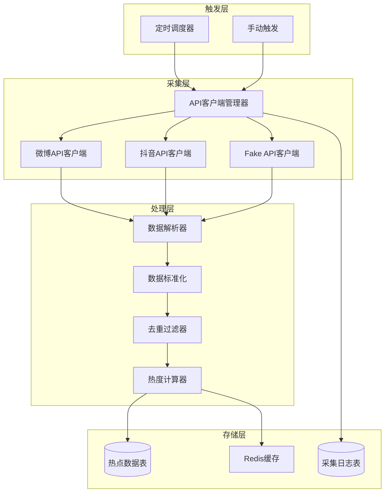
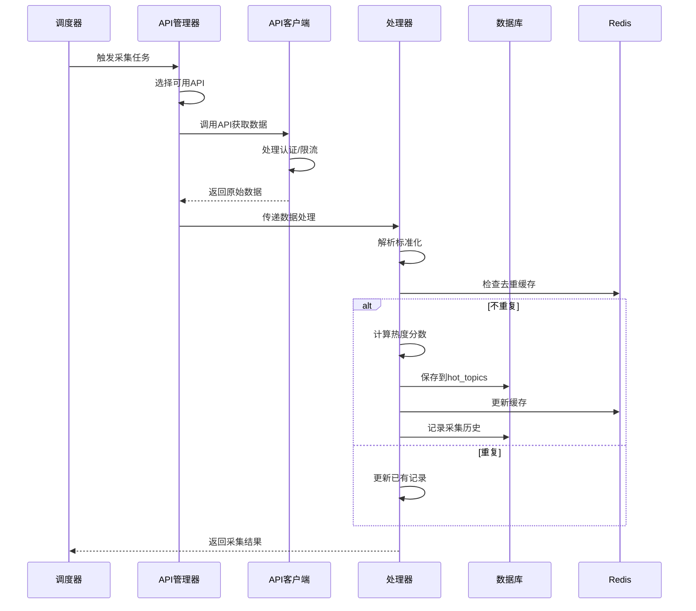

# 数据采集模块设计文档（完整存储版）

## 1. 设计原则

### 1.1 核心思路
- **API优先**：使用官方或第三方API，不自己实现爬虫
- **结构完整**：数据库设计要考虑未来扩展
- **快速验证**：开发阶段使用Fake API
- **聚焦业务**：重点在内容处理，而非数据获取技术

### 1.2 数据源
- **微博**：热搜榜、话题榜
- **抖音**：热点话题、热门视频

## 2. 数据采集架构

### 2.1 整体架构



### 2.2 完整存储结构

使用之前设计的完整数据库结构：

```sql
-- 热点内容表（保持原设计）
CREATE TABLE hot_topics (
    id UUID DEFAULT uuid_generate_v4() PRIMARY KEY,
    source VARCHAR(50) NOT NULL,  -- weibo, douyin
    source_id VARCHAR(200),  -- 原始来源ID
    source_url TEXT,  -- 原始链接
    title TEXT NOT NULL,
    content TEXT,
    category VARCHAR(50),
    keywords TEXT[],  -- PostgreSQL数组类型
    entities JSONB DEFAULT '{}',  -- 提取的实体（人名、地名等）
    score FLOAT DEFAULT 0,  -- 热度分数
    trend VARCHAR(20) DEFAULT 'stable',  -- rising, stable, falling
    metadata JSONB DEFAULT '{}',  -- 原始数据，包含所有平台特定字段
    collected_at TIMESTAMP DEFAULT CURRENT_TIMESTAMP,
    processed BOOLEAN DEFAULT FALSE,
    processed_at TIMESTAMP
);

-- 添加采集历史表（用于监控和分析）
CREATE TABLE collection_history (
    id UUID DEFAULT uuid_generate_v4() PRIMARY KEY,
    source VARCHAR(50) NOT NULL,
    api_endpoint VARCHAR(200),
    request_params JSONB,
    response_status INT,
    items_collected INT DEFAULT 0,
    error_message TEXT,
    duration_ms INT,
    created_at TIMESTAMP DEFAULT CURRENT_TIMESTAMP
);

-- 创建必要的索引
CREATE INDEX idx_hot_topics_source_collected ON hot_topics(source, collected_at DESC);
CREATE INDEX idx_hot_topics_processed ON hot_topics(processed, score DESC);
CREATE INDEX idx_collection_history_source_time ON collection_history(source, created_at DESC);
```

## 3. API适配层设计

### 3.1 统一API接口

```python
# 接口定义（伪代码）
class BaseAPIClient:
    """所有API客户端的基类"""
    
    def fetch_hot_topics(self) -> List[Dict]:
        """获取热点话题"""
        pass
    
    def parse_response(self, response: Dict) -> List[StandardizedTopic]:
        """解析响应数据为标准格式"""
        pass
    
    def handle_rate_limit(self):
        """处理API限流"""
        pass
```

### 3.2 数据标准化模型

```json
{
    "source": "weibo",
    "source_id": "7324589651",
    "source_url": "https://weibo.com/xxx",
    "title": "春节放假安排",
    "content": "详细内容文本...",
    "category": "社会",
    "keywords": ["春节", "放假", "2024"],
    "entities": {
        "time": ["2024年春节"],
        "location": [],
        "person": [],
        "org": ["国务院"]
    },
    "score": 0,  // 后续计算
    "trend": "rising",
    "metadata": {
        // 保存所有原始字段，便于后续扩展
        "hot_value": 2853421,
        "read_count": 1580000,
        "discuss_count": 25800,
        "original_rank": 1,
        "tags": ["置顶", "热"],
        "create_time": "2024-01-20 09:00:00"
    }
}
```

## 4. API配置管理

### 4.1 配置结构

```yaml
# config/api_config.yaml
apis:
  weibo:
    enabled: true
    type: "third_party"  # official, third_party, fake
    endpoints:
      hot_search: "https://api.weibo.com/2/trends/hourly.json"
      topic: "https://api.weibo.com/2/trends/weekly.json"
    auth:
      app_key: "${WEIBO_APP_KEY}"
      app_secret: "${WEIBO_APP_SECRET}"
    rate_limit:
      requests_per_hour: 1000
      concurrent_requests: 5
    schedule:
      interval_minutes: 10
      
  douyin:
    enabled: true
    type: "fake"  # 开发阶段使用fake
    endpoints:
      hot_board: "http://localhost:8001/fake/douyin/hot"
    schedule:
      interval_minutes: 15

fake_api:
  enabled: true
  data_files:
    weibo: "fake_data/weibo_hot.json"
    douyin: "fake_data/douyin_hot.json"
```

### 4.2 Fake API数据生成器

```python
# 用于开发测试的假数据生成器
class FakeDataGenerator:
    """生成符合真实API格式的测试数据"""
    
    @staticmethod
    def generate_weibo_hot(count=50):
        return {
            "code": 200,
            "data": {
                "update_time": datetime.now().isoformat(),
                "hot_list": [
                    {
                        "rank": i,
                        "title": f"测试热搜标题{i}",
                        "hot_value": random.randint(100000, 3000000),
                        "category": random.choice(["社会", "娱乐", "科技", "体育"]),
                        "url": f"https://weibo.com/hot/{i}",
                        "tags": random.choice([["热"], ["新"], ["爆"], []])
                    }
                    for i in range(1, count + 1)
                ]
            }
        }
```

## 5. 采集流程设计

### 5.1 主流程



### 5.2 去重机制

```python
# 使用Redis进行快速去重
class DuplicationChecker:
    """
    使用多级去重策略：
    1. source + source_id 精确匹配
    2. title相似度匹配（编辑距离）
    3. 内容指纹匹配（SimHash）
    """
    
    def get_content_key(self, source: str, source_id: str) -> str:
        return f"hot_topic:{source}:{source_id}"
    
    def get_title_hash(self, title: str) -> str:
        # 生成标题的模糊匹配键
        return f"title_hash:{hashlib.md5(title.lower().encode()).hexdigest()[:8]}"
```

## 6. 热度评分算法

### 6.1 综合评分模型

```python
class HotScoreCalculator:
    """热度分数计算器"""
    
    def calculate(self, topic: Dict) -> float:
        """
        综合评分 = 基础分 × 时效系数 × 增长系数 × 平台权重
        """
        base_score = self._calculate_base_score(topic)
        time_factor = self._calculate_time_factor(topic)
        growth_factor = self._calculate_growth_factor(topic)
        platform_weight = self._get_platform_weight(topic['source'])
        
        return base_score * time_factor * growth_factor * platform_weight
    
    def _calculate_base_score(self, topic: Dict) -> float:
        """基础分数：根据互动数据计算"""
        metadata = topic.get('metadata', {})
        
        if topic['source'] == 'weibo':
            hot_value = metadata.get('hot_value', 0)
            return math.log10(hot_value + 1) / 7  # 归一化到0-1
            
        elif topic['source'] == 'douyin':
            play_count = metadata.get('play_count', 0)
            return math.log10(play_count + 1) / 9  # 归一化到0-1
            
        return 0.5  # 默认分数
```

### 6.2 趋势判断

```python
class TrendAnalyzer:
    """分析热点趋势"""
    
    def analyze_trend(self, current_score: float, history: List[float]) -> str:
        """
        根据历史数据判断趋势
        返回: rising, stable, falling
        """
        if len(history) < 2:
            return 'stable'
            
        recent_avg = sum(history[-3:]) / len(history[-3:])
        change_rate = (current_score - recent_avg) / recent_avg
        
        if change_rate > 0.2:
            return 'rising'
        elif change_rate < -0.2:
            return 'falling'
        else:
            return 'stable'
```

## 7. 监控和日志

### 7.1 监控指标

```python
# 需要监控的关键指标
METRICS = {
    "api_success_rate": "API调用成功率",
    "items_collected_per_run": "每次采集数量",
    "duplicate_rate": "重复率",
    "processing_time": "处理耗时",
    "hot_topics_count": "有效热点数量"
}
```

### 7.2 日志记录

```python
# 结构化日志
logger.info("采集任务完成", extra={
    "source": "weibo",
    "items_collected": 50,
    "duplicates": 5,
    "errors": 0,
    "duration_ms": 1235,
    "api_calls": 1
})
```

## 8. 错误处理

### 8.1 异常处理策略

| 异常类型 | 处理方式 | 重试策略 |
|----------|----------|----------|
| API认证失败 | 记录日志，切换备用API | 不重试 |
| 请求超时 | 等待后重试 | 最多3次，指数退避 |
| 限流错误 | 等待冷却时间 | 根据API规则等待 |
| 解析错误 | 记录详情，跳过该条 | 不重试 |
| 数据库错误 | 缓存到Redis | 延迟重试 |

### 8.2 降级方案

```python
class CollectionFallback:
    """采集降级方案"""
    
    def get_fallback_strategy(self, source: str, error_type: str):
        strategies = {
            "api_limit": self.use_cache_data,
            "api_error": self.switch_to_fake_api,
            "parse_error": self.use_simplified_parser,
            "db_error": self.cache_to_redis
        }
        return strategies.get(error_type, self.skip_and_log)
```
