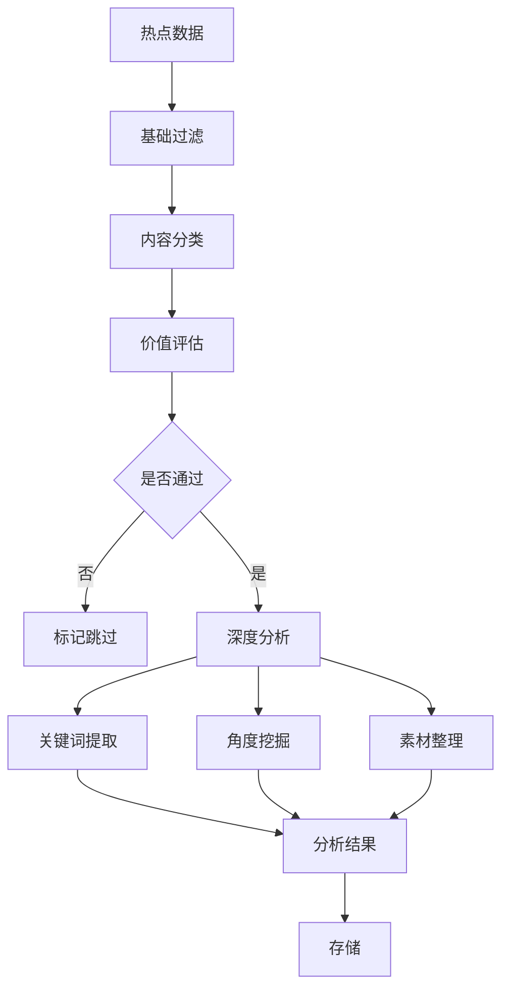
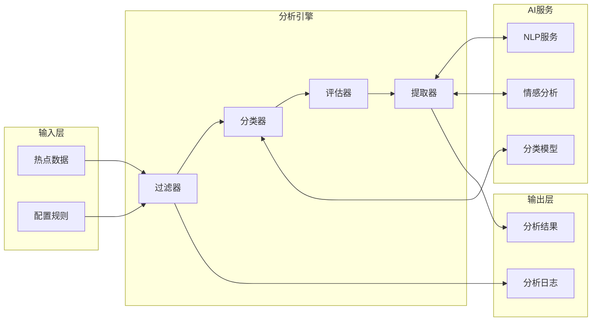
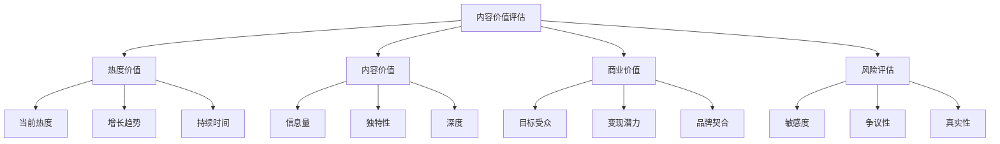

# 内容分析模块详细设计文档

## 1. 模块概述

### 1.1 模块定位
内容分析模块是连接"原始热点"和"内容生成"的桥梁，负责从海量热点中筛选出有价值的内容素材，并提供详细的分析数据供后续生成使用。

### 1.2 核心目标
- **价值识别**：准确识别有内容价值的热点
- **风险控制**：过滤敏感和低质量内容
- **信息提取**：提取关键要素供生成使用
- **分类准确**：正确分类到合适的内容类别

### 1.3 关键指标
- 分析准确率 > 85%
- 处理速度 < 500ms/条
- 误判率 < 5%
- 关键信息提取完整度 > 90%

## 2. 分析流程设计

### 2.1 整体流程



### 2.2 模块架构



## 3. 基础过滤设计

### 3.1 过滤规则

```yaml
filter_rules:
  # 黑名单过滤
  blacklist:
    keywords:
      - 敏感词1
      - 敏感词2
    categories:
      - 政治
      - 违法
      
  # 质量过滤
  quality:
    min_length: 10  # 标题最少字数
    max_length: 100  # 标题最多字数
    min_heat_score: 0.3  # 最低热度分
    
  # 时效过滤
  timeliness:
    max_age_hours: 24  # 最大时效（小时）
    
  # 重复过滤
  duplication:
    similarity_threshold: 0.85  # 相似度阈值
```

### 3.2 过滤策略

| 过滤级别 | 过滤内容 | 处理方式 |
|----------|----------|----------|
| L1-违规过滤 | 敏感词、违规内容 | 直接丢弃，记录日志 |
| L2-质量过滤 | 标题过短、内容空洞 | 标记低质量 |
| L3-时效过滤 | 过期内容 | 降低优先级 |
| L4-相似过滤 | 高度相似内容 | 保留最优 |

## 4. 内容分类设计

### 4.1 分类体系

```yaml
categories:
  科技:
    keywords: [AI, 互联网, 手机, 软件, 硬件]
    sub_categories:
      - 人工智能
      - 互联网
      - 消费电子
      - 软件应用
      
  生活:
    keywords: [美食, 旅游, 健康, 家居]
    sub_categories:
      - 美食料理
      - 旅游出行
      - 健康养生
      - 家居生活
      
  娱乐:
    keywords: [明星, 电影, 音乐, 综艺]
    sub_categories:
      - 明星八卦
      - 影视资讯
      - 音乐动态
      - 综艺节目
      
  财经:
    keywords: [股票, 理财, 经济, 投资]
    sub_categories:
      - 股市动态
      - 投资理财
      - 宏观经济
      - 行业分析
```

### 4.2 分类算法

```python
# 多策略分类器设计
class ContentClassifier:
    """
    使用多种策略进行分类：
    1. 关键词匹配
    2. AI模型分类
    3. 规则匹配
    """
    
    def classify(self, content):
        # 策略1：关键词匹配
        keyword_category = self.keyword_matching(content)
        
        # 策略2：AI分类（如果关键词匹配置信度低）
        if self.need_ai_classification(keyword_category):
            ai_category = self.ai_classification(content)
            
        # 策略3：规则修正
        final_category = self.rule_based_correction(
            keyword_category, 
            ai_category,
            content
        )
        
        return final_category
```

## 5. 价值评估设计

### 5.1 评估维度



### 5.2 评分模型

```yaml
value_scoring:
  # 热度价值 (40%)
  heat_value:
    weight: 0.4
    factors:
      current_heat: 0.5
      growth_rate: 0.3
      duration: 0.2
      
  # 内容价值 (30%)
  content_value:
    weight: 0.3
    factors:
      information_density: 0.4
      uniqueness: 0.4
      depth_potential: 0.2
      
  # 商业价值 (20%)
  business_value:
    weight: 0.2
    factors:
      audience_size: 0.4
      monetization: 0.3
      brand_fit: 0.3
      
  # 风险折扣 (10%)
  risk_discount:
    weight: -0.1
    factors:
      sensitivity: 0.5
      controversy: 0.3
      reliability: 0.2
```

### 5.3 价值判断规则

| 分数区间 | 价值等级 | 处理建议 |
|----------|----------|----------|
| 0.8-1.0 | S级 | 优先处理，多角度生成 |
| 0.6-0.8 | A级 | 正常处理，标准生成 |
| 0.4-0.6 | B级 | 选择性处理 |
| 0.2-0.4 | C级 | 低优先级 |
| 0-0.2 | D级 | 不处理 |

## 6. 深度分析设计

### 6.1 关键信息提取

```json
{
    "extracted_info": {
        "core_event": "春节放假安排发布",
        "key_points": [
            "放假时间：2月9日至17日",
            "共9天假期",
            "调休安排：2月4日、18日上班"
        ],
        "entities": {
            "time": ["2024年春节", "2月9日", "2月17日"],
            "location": ["全国"],
            "person": [],
            "organization": ["国务院办公厅"]
        },
        "numbers": {
            "假期天数": 9,
            "调休天数": 2
        },
        "sentiment": "positive",
        "keywords": ["春节", "放假", "调休", "假期安排"]
    }
}
```

### 6.2 内容角度挖掘

```yaml
angle_mining:
  # 基础角度
  basic_angles:
    - 事实陈述：直接介绍热点内容
    - 背景解读：提供背景信息
    - 影响分析：分析可能的影响
    
  # 深度角度
  deep_angles:
    - 对比分析：与历史或其他情况对比
    - 专业解读：从专业角度解析
    - 实用指南：提供实用建议
    - 趋势预测：预测未来发展
    
  # 互动角度
  interactive_angles:
    - 话题讨论：引发读者讨论
    - 经验分享：分享相关经验
    - 问题解答：回答常见问题
```

### 6.3 素材整理

```python
class MaterialOrganizer:
    """素材整理器"""
    
    def organize(self, hot_topic, analysis_result):
        return {
            # 基础信息
            "basic": {
                "title": hot_topic.title,
                "summary": self.generate_summary(hot_topic),
                "category": analysis_result.category,
                "heat_score": hot_topic.score
            },
            
            # 核心素材
            "materials": {
                "facts": self.extract_facts(analysis_result),
                "quotes": self.extract_quotes(hot_topic),
                "data": self.extract_data(analysis_result),
                "background": self.gather_background(hot_topic)
            },
            
            # 创作建议
            "suggestions": {
                "angles": analysis_result.suggested_angles,
                "style": self.suggest_style(analysis_result),
                "length": self.suggest_length(analysis_result),
                "keywords": analysis_result.keywords
            },
            
            # 注意事项
            "warnings": {
                "sensitive_points": analysis_result.sensitive_points,
                "avoid_words": analysis_result.avoid_words,
                "fact_check": analysis_result.fact_check_items
            }
        }
```

## 7. 数据存储设计

### 7.1 分析结果存储

```sql
-- 内容分析结果表
CREATE TABLE content_analysis (
    id UUID DEFAULT uuid_generate_v4() PRIMARY KEY,
    topic_id UUID REFERENCES hot_topics(id),
    
    -- 分类信息
    category VARCHAR(50) NOT NULL,
    sub_category VARCHAR(50),
    confidence FLOAT,
    
    -- 价值评估
    value_score FLOAT NOT NULL,
    heat_value FLOAT,
    content_value FLOAT,
    business_value FLOAT,
    risk_score FLOAT,
    
    -- 提取的信息
    extracted_entities JSONB,
    keywords TEXT[],
    key_points JSONB,
    
    -- 内容建议
    suggested_angles JSONB,
    suggested_style VARCHAR(50),
    suggested_length INT,
    
    -- 风险标记
    has_sensitive_content BOOLEAN DEFAULT FALSE,
    sensitive_reasons TEXT[],
    
    -- 状态
    analysis_status VARCHAR(20) DEFAULT 'completed',
    
    created_at TIMESTAMP DEFAULT CURRENT_TIMESTAMP,
    updated_at TIMESTAMP DEFAULT CURRENT_TIMESTAMP
);

-- 创建索引
CREATE INDEX idx_content_analysis_value ON content_analysis(value_score DESC);
CREATE INDEX idx_content_analysis_category ON content_analysis(category);
CREATE INDEX idx_content_analysis_status ON content_analysis(analysis_status);
```

## 8. AI服务集成

### 8.1 NLP服务调用

```yaml
nlp_services:
  # 关键词提取
  keyword_extraction:
    service: "jieba"
    backup: "textrank"
    config:
      top_k: 10
      
  # 实体识别
  ner:
    service: "spacy"
    model: "zh_core_web_sm"
    
  # 情感分析
  sentiment:
    service: "baidu_nlp"
    fallback: "textblob"
    
  # 文本分类
  classification:
    service: "fasttext"
    model: "content_classifier_v1"
```

### 8.2 AI调用策略

```python
class AIServiceManager:
    """AI服务管理器"""
    
    def __init__(self):
        self.services = {
            'classification': ClassificationService(),
            'ner': NERService(),
            'sentiment': SentimentService()
        }
        
    async def analyze_with_fallback(self, text, service_type):
        """带降级的AI服务调用"""
        primary_service = self.services[service_type]
        
        try:
            result = await primary_service.analyze(text)
            return result
        except Exception as e:
            # 降级到备用服务或规则
            logger.warning(f"Primary service failed: {e}")
            return await self.fallback_analyze(text, service_type)
```

## 9. 性能优化

### 9.1 批处理设计

```python
class BatchAnalyzer:
    """批量分析器"""
    
    def __init__(self, batch_size=50):
        self.batch_size = batch_size
        self.queue = []
        
    async def analyze_batch(self, topics):
        """批量分析，提高效率"""
        # 1. 批量过滤
        filtered = await self.batch_filter(topics)
        
        # 2. 批量分类（调用AI服务）
        classified = await self.batch_classify(filtered)
        
        # 3. 并行价值评估
        evaluated = await asyncio.gather(*[
            self.evaluate_value(topic) 
            for topic in classified
        ])
        
        # 4. 批量存储
        await self.batch_save(evaluated)
        
        return evaluated
```

### 9.2 缓存策略

```python
# Redis缓存键设计
CACHE_KEYS = {
    "classification": "analysis:classification:{content_hash}",
    "keywords": "analysis:keywords:{content_hash}",
    "entities": "analysis:entities:{content_hash}"
}

# 缓存时间
CACHE_TTL = {
    "classification": 3600 * 24,  # 24小时
    "keywords": 3600 * 12,  # 12小时
    "entities": 3600 * 12   # 12小时
}
```

## 10. 监控指标

### 10.1 关键指标

| 指标 | 说明 | 告警阈值 |
|------|------|----------|
| 分析成功率 | 成功分析的比例 | < 95% |
| 平均处理时间 | 单条分析耗时 | > 1秒 |
| AI服务可用性 | AI服务调用成功率 | < 90% |
| 分类准确率 | 分类正确的比例 | < 85% |
| 价值识别率 | 有价值内容识别率 | < 70% |

### 10.2 质量保证

```python
class QualityMonitor:
    """质量监控"""
    
    def __init__(self):
        self.metrics = {
            'total_analyzed': 0,
            'analysis_success': 0,
            'classification_accuracy': 0.0,
            'avg_processing_time': 0.0
        }
        
    def check_analysis_quality(self, result):
        """检查分析质量"""
        checks = {
            'has_category': result.category is not None,
            'has_keywords': len(result.keywords) >= 3,
            'has_value_score': 0 <= result.value_score <= 1,
            'has_entities': result.entities is not None
        }
        
        quality_score = sum(checks.values()) / len(checks)
        return quality_score >= 0.8
```

