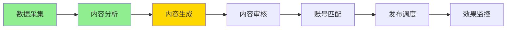
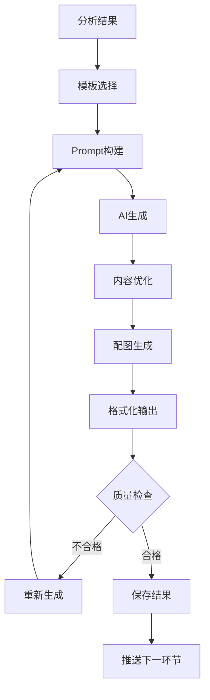
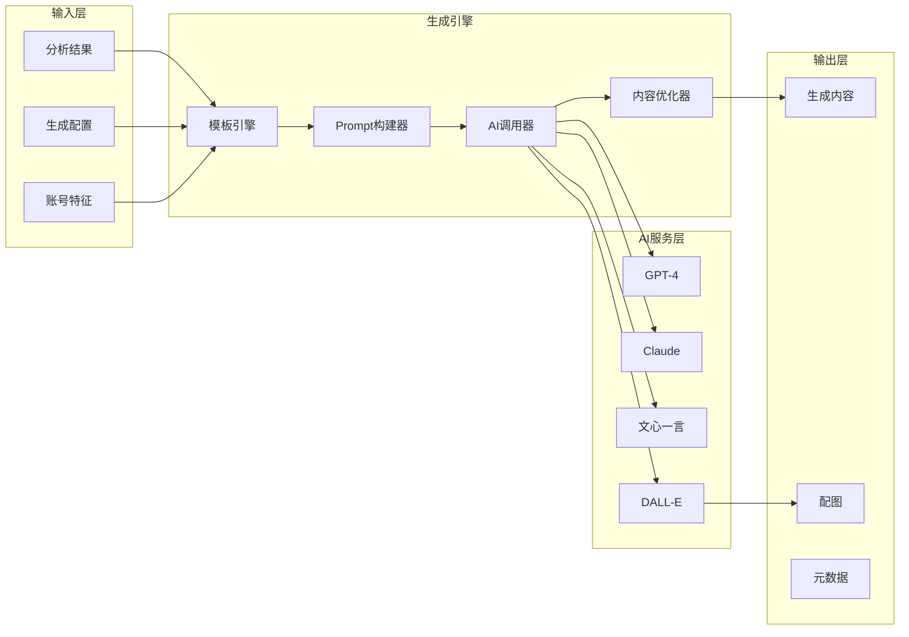
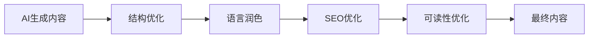
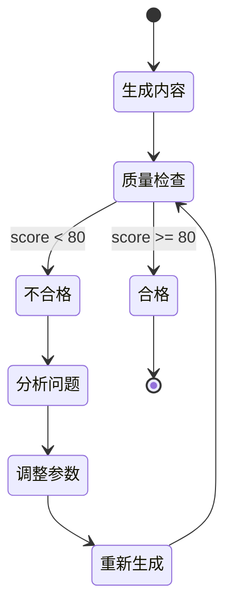

根据业务流程，内容分析之后的下一个
模块是**内容生成模块**。



# 内容生成模块详细设计文档

## 1. 模块概述

### 1.1 模块定位
内容生成模块是系统的核心价值模块，负责基于分析后的热点素材，利用AI技术生成高质量、原创的内容，是实现"自动化内容生产"的关键环节。

### 1.2 核心目标
- **高质量**：生成的内容要有深度、有价值
- **原创性**：确保内容原创度 > 95%
- **多样性**：支持多种内容风格和形式
- **高效率**：平均生成时间 < 30秒

### 1.3 关键指标
- 内容质量分 > 80
- 原创度 > 95%
- 生成成功率 > 90%
- 平均生成时间 < 30秒
- AI成本控制在预算内

## 2. 生成流程设计

### 2.1 整体流程



### 2.2 模块架构



## 3. 内容模板系统

### 3.1 模板分类

```yaml
templates:
  # 新闻资讯类
  news:
    structure:
      - hook: "引人注目的开头"
      - background: "事件背景"
      - details: "详细信息"
      - analysis: "深度分析"
      - conclusion: "总结展望"
    styles:
      - objective: "客观陈述"
      - analytical: "分析解读"
      - opinion: "观点评论"
      
  # 科技评测类
  tech:
    structure:
      - introduction: "产品/技术介绍"
      - features: "特点分析"
      - comparison: "对比分析"
      - experience: "使用体验"
      - verdict: "结论建议"
    styles:
      - professional: "专业评测"
      - casual: "轻松体验"
      
  # 生活分享类
  lifestyle:
    structure:
      - story_lead: "故事引入"
      - main_content: "主要内容"
      - tips: "实用建议"
      - interaction: "互动话题"
    styles:
      - personal: "个人分享"
      - guide: "指南教程"
      
  # 观点评论类
  opinion:
    structure:
      - viewpoint: "核心观点"
      - arguments: "论据支撑"
      - counter_arguments: "不同视角"
      - conclusion: "总结呼吁"
    styles:
      - rational: "理性分析"
      - emotional: "情感共鸣"
```

### 3.2 模板选择算法

```python
class TemplateSelector:
    """智能模板选择器"""
    
    def select_template(self, analysis_result, account_profile):
        """
        基于内容分析结果和账号特征选择最佳模板
        """
        # 1. 根据类别初筛模板
        category_templates = self.get_templates_by_category(
            analysis_result.category
        )
        
        # 2. 计算模板匹配度
        scores = {}
        for template in category_templates:
            score = self.calculate_match_score(
                template,
                analysis_result,
                account_profile
            )
            scores[template.id] = score
            
        # 3. 选择最佳模板
        best_template_id = max(scores, key=scores.get)
        return self.get_template(best_template_id)
        
    def calculate_match_score(self, template, analysis, profile):
        """计算模板匹配度"""
        # 内容匹配度（40%）
        content_match = self.calc_content_match(template, analysis)
        
        # 账号风格匹配度（30%）
        style_match = self.calc_style_match(template, profile)
        
        # 历史表现（30%）
        historical_performance = self.get_template_performance(
            template.id,
            profile.account_id
        )
        
        return (content_match * 0.4 + 
                style_match * 0.3 + 
                historical_performance * 0.3)
```

## 4. Prompt工程设计

### 4.1 Prompt结构

```python
class PromptBuilder:
    """Prompt构建器"""
    
    def build_prompt(self, template, materials, config):
        """构建结构化的Prompt"""
        
        prompt_structure = {
            # 系统指令层
            "system": self.build_system_instruction(config),
            
            # 角色定义层
            "role": self.build_role_definition(template, config),
            
            # 任务说明层
            "task": self.build_task_description(template),
            
            # 素材输入层
            "materials": self.format_materials(materials),
            
            # 要求约束层
            "requirements": self.build_requirements(template, config),
            
            # 示例参考层（Few-shot）
            "examples": self.get_examples(template),
            
            # 输出格式层
            "output_format": self.define_output_format()
        }
        
        return self.assemble_prompt(prompt_structure)
```

### 4.2 Prompt模板示例

```yaml
prompt_templates:
  tech_article:
    system: |
      你是一位专业的科技内容创作者，擅长将复杂的技术概念
      用通俗易懂的方式解释给普通读者。
      
    task: |
      基于以下热点信息，创作一篇科技类文章：
      - 字数要求：{word_count}字左右
      - 风格要求：{style}
      - 目标读者：{target_audience}
      
    requirements:
      - 保持客观中立的态度
      - 使用数据和事实支撑观点
      - 适当加入专业分析
      - 语言通俗易懂
      - 结构清晰完整
      
    output_format: |
      标题：[吸引人的标题]
      
      正文：
      [开头段落]
      
      [主体内容，包含3-4个要点]
      
      [结尾总结]
      
      关键词：[3-5个关键词]
```

### 4.3 动态Prompt优化

```python
class PromptOptimizer:
    """Prompt动态优化器"""
    
    def optimize_prompt(self, base_prompt, context):
        """根据上下文动态优化Prompt"""
        
        # 1. 时效性注入
        if context.is_breaking_news:
            base_prompt = self.inject_timeliness(base_prompt)
            
        # 2. 热度增强
        if context.heat_score > 0.8:
            base_prompt = self.enhance_engagement(base_prompt)
            
        # 3. 风险规避
        if context.has_sensitive_content:
            base_prompt = self.add_safety_constraints(base_prompt)
            
        # 4. 个性化调整
        base_prompt = self.personalize_for_account(
            base_prompt, 
            context.account_profile
        )
        
        return base_prompt
```

## 5. AI模型调用策略

### 5.1 模型选择矩阵

| 内容类型 | 首选模型 | 备选模型 | 选择理由 |
|----------|----------|----------|----------|
| 新闻资讯 | GPT-4 | Claude | 事实准确性高 |
| 深度分析 | Claude | GPT-4 | 逻辑性强 |
| 创意内容 | GPT-4 | 文心一言 | 创造力强 |
| 本土内容 | 文心一言 | GPT-4 | 中文理解好 |

### 5.2 调用参数配置

```yaml
model_configs:
  gpt-4:
    temperature: 0.7  # 创造性
    max_tokens: 2000
    top_p: 0.9
    frequency_penalty: 0.3  # 避免重复
    presence_penalty: 0.3   # 鼓励新话题
    
  claude:
    temperature: 0.6
    max_tokens: 2500
    top_p: 0.85
    
  wenxin:
    temperature: 0.7
    max_tokens: 2000
    top_p: 0.9
    
# 不同场景的参数调整
scenarios:
  factual:  # 事实性内容
    temperature: 0.3
    top_p: 0.7
    
  creative:  # 创意内容
    temperature: 0.9
    top_p: 0.95
    
  analytical:  # 分析性内容
    temperature: 0.5
    top_p: 0.8
```

### 5.3 成本控制策略

```python
class CostController:
    """AI调用成本控制器"""
    
    def __init__(self, daily_budget=100):
        self.daily_budget = daily_budget
        self.usage_tracker = UsageTracker()
        
    def should_use_model(self, model, estimated_tokens):
        """判断是否可以使用指定模型"""
        # 1. 检查日预算
        if self.usage_tracker.get_daily_cost() >= self.daily_budget:
            return False, "daily_budget_exceeded"
            
        # 2. 计算本次成本
        estimated_cost = self.calculate_cost(model, estimated_tokens)
        
        # 3. 优先级判断
        if estimated_cost > 1.0:  # 高成本调用
            return self.high_cost_approval(model, estimated_cost)
            
        return True, "approved"
        
    def select_cost_effective_model(self, preferred_model, content_type):
        """选择性价比最高的模型"""
        if self.is_peak_hour():
            # 高峰期使用便宜的模型
            return self.get_economy_model(content_type)
        else:
            return preferred_model
```

## 6. 内容优化处理

### 6.1 优化流程



### 6.2 优化策略

```python
class ContentOptimizer:
    """内容优化器"""
    
    def optimize(self, raw_content):
        """全方位内容优化"""
        # 1. 结构优化
        content = self.optimize_structure(raw_content)
        
        # 2. 标题优化
        content.title = self.optimize_title(content.title)
        
        # 3. 段落优化
        content.paragraphs = self.optimize_paragraphs(content.paragraphs)
        
        # 4. SEO优化
        content = self.seo_optimization(content)
        
        # 5. 情感增强
        content = self.enhance_engagement(content)
        
        return content
        
    def optimize_title(self, title):
        """标题优化"""
        optimizations = {
            'add_numbers': self.try_add_numbers,
            'add_emotion': self.try_add_emotion_words,
            'add_curiosity': self.try_add_curiosity_gap,
            'optimize_length': self.optimize_title_length
        }
        
        for name, func in optimizations.items():
            title = func(title)
            
        return title
        
    def optimize_paragraphs(self, paragraphs):
        """段落优化"""
        optimized = []
        for para in paragraphs:
            # 控制段落长度
            if len(para) > 200:
                split_paras = self.split_paragraph(para)
                optimized.extend(split_paras)
            else:
                # 添加过渡词
                para = self.add_transitions(para)
                optimized.append(para)
                
        return optimized
```

### 6.3 SEO优化

```python
class SEOOptimizer:
    """SEO优化器"""
    
    def optimize(self, content, keywords):
        """SEO优化处理"""
        # 1. 关键词密度优化
        content = self.optimize_keyword_density(content, keywords)
        
        # 2. 标题标签优化
        content = self.add_headings(content)
        
        # 3. 元描述生成
        content.meta_description = self.generate_meta_description(content)
        
        # 4. 内链建议
        content.internal_links = self.suggest_internal_links(content)
        
        return content
        
    def optimize_keyword_density(self, content, keywords):
        """优化关键词密度"""
        current_density = self.calculate_keyword_density(content, keywords)
        target_density = 0.02  # 2%
        
        if current_density < target_density:
            # 自然地增加关键词
            content = self.insert_keywords_naturally(content, keywords)
        elif current_density > target_density * 1.5:
            # 减少关键词避免过度优化
            content = self.reduce_keywords(content, keywords)
            
        return content
```

## 7. 配图生成系统

### 7.1 配图策略

```yaml
image_strategies:
  # 新闻类配图
  news:
    count: 1-3
    types:
      - news_photo      # 新闻图片
      - infographic    # 信息图表
      - illustration   # 插画说明
      
  # 科技类配图
  tech:
    count: 2-4
    types:
      - product_image   # 产品图
      - comparison_chart # 对比图表
      - workflow_diagram # 流程图
      - screenshot      # 截图
      
  # 生活类配图
  lifestyle:
    count: 3-5
    types:
      - scene_photo     # 场景图片
      - step_guide      # 步骤指南
      - tips_card       # 贴士卡片
```

### 7.2 图片生成流程

```python
class ImageGenerator:
    """配图生成器"""
    
    def generate_images(self, content, strategy):
        """生成配图"""
        images = []
        
        # 1. 分析内容确定配图点
        image_points = self.analyze_image_points(content)
        
        # 2. 为每个配图点生成图片
        for point in image_points:
            if point.type == 'ai_generated':
                # AI生成
                image = await self.generate_ai_image(point)
            elif point.type == 'chart':
                # 图表生成
                image = self.generate_chart(point)
            elif point.type == 'template':
                # 模板图片
                image = self.create_from_template(point)
                
            images.append(image)
            
        # 3. 图片后处理
        images = self.post_process_images(images)
        
        return images
        
    def generate_ai_image_prompt(self, context):
        """生成图片Prompt"""
        return {
            'prompt': f"{context.description}, {context.style}, high quality",
            'negative_prompt': "low quality, blurry, watermark",
            'size': "1024x1024",
            'style': context.image_style
        }
```

## 8. 质量控制

### 8.1 质量检查项

```python
class QualityChecker:
    """质量检查器"""
    
    def check(self, content):
        """全面质量检查"""
        checks = {
            'originality': self.check_originality(content),
            'completeness': self.check_completeness(content),
            'readability': self.check_readability(content),
            'accuracy': self.check_accuracy(content),
            'compliance': self.check_compliance(content)
        }
        
        # 计算总分
        total_score = sum(
            check['score'] * check['weight'] 
            for check in checks.values()
        )
        
        return {
            'passed': total_score >= 80,
            'score': total_score,
            'details': checks
        }
        
    def check_originality(self, content):
        """原创性检查"""
        # 1. 计算与已有内容的相似度
        similarity = self.calculate_similarity(content)
        
        # 2. 检查是否有抄袭
        plagiarism = self.detect_plagiarism(content)
        
        score = 100 * (1 - max(similarity, plagiarism))
        
        return {
            'score': score,
            'weight': 0.3,
            'passed': score >= 95
        }
```

### 8.2 质量改进循环



## 9. 数据存储

### 9.1 生成内容存储

```sql
-- 使用之前设计的表结构
-- generated_contents 表已包含所有必要字段

-- 添加生成历史表（用于追踪和优化）
CREATE TABLE generation_history (
    id UUID DEFAULT uuid_generate_v4() PRIMARY KEY,
    content_id UUID REFERENCES generated_contents(id),
    
    -- 生成参数
    model_name VARCHAR(50),
    model_params JSONB,
    prompt_template TEXT,
    
    -- 生成过程
    attempt_number INT DEFAULT 1,
    generation_time_ms INT,
    token_usage JSONB,
    cost DECIMAL(10, 4),
    
    -- 质量数据
    quality_score FLOAT,
    quality_details JSONB,
    
    created_at TIMESTAMP DEFAULT CURRENT_TIMESTAMP
);

-- 创建索引
CREATE INDEX idx_generation_history_content ON generation_history(content_id);
CREATE INDEX idx_generation_history_model ON generation_history(model_name);
```

## 10. 性能优化

### 10.1 并发生成

```python
class ConcurrentGenerator:
    """并发生成管理器"""
    
    def __init__(self, max_concurrent=5):
        self.semaphore = asyncio.Semaphore(max_concurrent)
        self.rate_limiter = RateLimiter()
        
    async def generate_batch(self, tasks):
        """批量生成内容"""
        results = []
        
        # 使用信号量控制并发
        async def generate_with_limit(task):
            async with self.semaphore:
                # 速率限制
                await self.rate_limiter.acquire()
                
                # 生成内容
                result = await self.generate_single(task)
                return result
                
        # 并发执行
        results = await asyncio.gather(*[
            generate_with_limit(task) for task in tasks
        ])
        
        return results
```

### 10.2 缓存策略

```python
# 缓存Prompt模板和生成结果
CACHE_CONFIG = {
    'prompt_templates': {
        'ttl': 3600 * 24,  # 24小时
        'key_pattern': 'prompt:template:{template_id}'
    },
    'generation_results': {
        'ttl': 3600 * 12,  # 12小时
        'key_pattern': 'content:generated:{content_hash}'
    },
    'model_responses': {
        'ttl': 3600 * 6,   # 6小时
        'key_pattern': 'ai:response:{prompt_hash}'
    }
}
```

